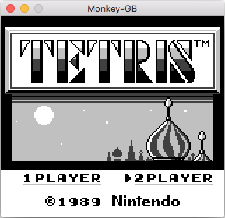
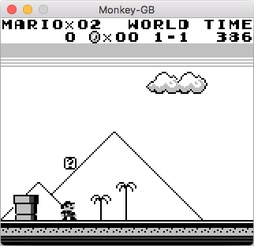
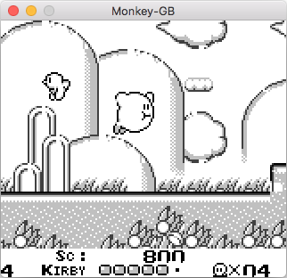
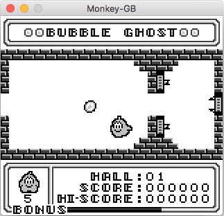

# monkey-gb

Gameboy emulator written in Kotlin.

## Screenshots




## Building

1. Clone the repo:

```sh
git clone https://github.com/andrea321123/monkey-gb
cd monkey-gb
```
2. Compile with Gradle:

```sh
./gradlew build

```

## Usage

Run with Gradle:
```sh
./gradlew run --args="[ROM file]"
```
where [ROM file] is the name of the ROM we want to run.

## Screenshots




## Issues

The emulator has issues running some games; furthermore, MBC3 memory banking and sound aren't implemented yet.
